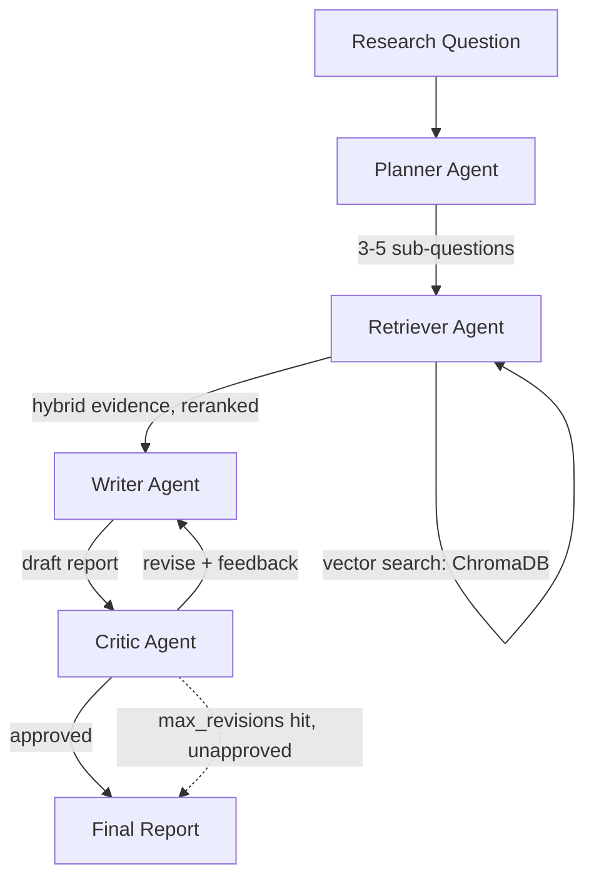

# Multi-Agent Research Assistant

A LangGraph-orchestrated multi-agent system that takes a research question, plans a
research strategy, gathers evidence from hybrid web + vector-store retrieval,
synthesizes a cited report, and critiques/revises its own output through a
reflection loop.

Built as a portfolio project demonstrating: multi-agent orchestration, cost-aware
model routing, hybrid retrieval design, self-critique loops, and reproducible
evaluation — not just a working demo, but a system I can defend on a whiteboard.

## Architecture



**State object** (`graph/state.py`) carries: the original question, the plan
(sub-questions + rationale), retrieved evidence (with source metadata — URL or
arXiv ID), the draft/final report, critic feedback, a revision counter, and
observability data (per-node timings, token usage, a human-readable step log)
used by both the Streamlit UI and the eval suite.

## Model routing

| Node | Model | Why |
|---|---|---|
| Planner | **Pluggable**: Gemma 3 4B via Ollama (`local`) or Deepseek V4 Flash via OpenRouter (`api`, default) | Decomposition is a lower-reasoning-burden task than synthesis or critique — cheapest place to demonstrate cost-aware routing without hurting quality where it matters most. |
| Retriever (rerank/filter) | Deepseek V4 Flash | No LLM needed for retrieval itself; a small model just filters the combined web+vector pool down to what's actually relevant per sub-question. |
| Writer | Deepseek V4 Flash | Heaviest-reasoning node — synthesizing cited, coherent prose from raw evidence. |
| Critic | Deepseek V4 Flash | Evaluation task — checking claims against evidence, not generating novel content. |

Every node's model is a single constant in `graph/config.py` — swapping any
node's model is a one-line change, which is itself the point: the routing table
is legible and independently tunable per node, not hardcoded into each agent.

### Why the Planner has a pluggable local/API backend

Set via `PLANNER_BACKEND=local|api` (env var, defaults to `api`):
- **`api` (default)**: anyone who clones this repo can run the *entire* system
  with just an OpenRouter key — no GPU, no Ollama install, no local model pull.
  That's a deliberate portability decision: the system should be safe to hand to
  an interviewer to run themselves, or demo live without depending on local
  hardware behaving.
- **`local`**: routes the Planner to Gemma 3 4B via Ollama, demonstrating local
  LLM deployment under a real 4GB VRAM constraint. This is the local-inference
  story I can show *on my own machine* when I want to, on my terms, rather than
  as a runtime dependency baked into the default path.

### Why Deepseek V4 Flash over Claude Sonnet for the heavy-reasoning nodes

Cost-performance tradeoff. Deepseek V4 Flash is priced around $0.10 / $0.20 per
million input/output tokens with a 1M-token context window and function-calling
support, and lands close to frontier-model quality on agentic/reasoning
benchmarks at that price point. For a multi-question, multi-revision pipeline
where the Writer and Critic can each run 2-3 times per query, the per-query cost
compounds — running those nodes on a frontier closed model would multiply cost
for reasoning quality this pipeline doesn't need at every step. Alternatives I
evaluated: **Claude Haiku 4.5** (better reasoning-per-dollar than most small
models, but pricier than Deepseek V4 Flash for this volume) and **Gemini 2.5
Flash** (comparable price, less consistent structured-JSON output in my testing).
Claude Sonnet-tier is reserved as an easy upgrade path for the Writer node
specifically if eval numbers show synthesis quality is the bottleneck — see
`graph/config.py`, one constant to change.

## Tech stack

- **Orchestration**: LangGraph (Python)
- **LLMs**: Deepseek V4 Flash via OpenRouter (Writer, Critic, Retriever-rerank,
  Planner default); Gemma 3 4B via Ollama (Planner, optional local mode)
- **Vector store**: ChromaDB (local, persistent), seeded with 15 short
  original summaries of agentic-AI/RAG papers (ReAct, Reflexion, Self-RAG, CRAG,
  RAPTOR, etc. — see `tools/seed_corpus.py`)
- **Web search**: Tavily API
- **Backend**: FastAPI (`api/main.py`) — request/response API layer, independent
  of the UI
- **Frontend**: Streamlit (`ui/app.py`) — runs the graph in-process via
  `.stream()` so each agent's output renders live as it completes, not as one
  final blob of text
- **Evaluation**: RAGAS (faithfulness, answer relevance) + custom operational
  metrics (revision cycles, per-node latency, per-query cost)

## Folder structure

```
/agents     - planner.py, retriever.py, writer.py, critic.py, utils.py
/graph      - state.py (shared state schema), config.py (model routing), graph.py (StateGraph wiring)
/tools      - web_search.py (Tavily), vector_store.py (ChromaDB), seed_corpus.py
/api        - FastAPI app
/ui         - Streamlit app
/eval       - two-stage eval suite (see below)
/tests      - mocked smoke tests for graph control flow
```

## Setup

```bash
python -m venv venv && source venv/bin/activate
pip install -r requirements.txt
cp .env.example .env   # fill in OPENROUTER_API_KEY and TAVILY_API_KEY
```

Both keys have generous free tiers (OpenRouter: pay-as-you-go, a few dollars
covers this whole project many times over; Tavily: 1,000 free searches/month).

### Run from the CLI

```bash
python main.py "What are the main approaches to reducing hallucination in RAG systems?"
python main.py "..." --max-revisions 1
PLANNER_BACKEND=local python main.py "..."   # requires: ollama pull gemma3:4b
```

### Run the Streamlit UI

```bash
streamlit run ui/app.py
```

### Run the FastAPI layer

```bash
uvicorn api.main:app --reload --port 8000
# then POST to http://localhost:8000/research, docs at /docs
```

### Run the evaluation suite

RAGAS's dependency chain currently conflicts with the langgraph/langchain-core
1.x stack the main pipeline uses (see Known Limitations), so eval runs in two
stages across two environments:

```bash
# Stage A -- runs the pipeline on 8 test questions, in the MAIN venv
python eval/generate_results.py            # writes eval/eval_results.json

# Stage B -- scores those results with RAGAS, in the isolated eval venv
python -m venv eval_venv
./eval_venv/bin/pip install -r eval/requirements.txt
./eval_venv/bin/python eval/ragas_eval.py    # writes eval/eval_report.md + .csv
```

## Design decisions

**Why LangGraph over plain LangChain agents?** This pipeline needs an explicit
cycle (Writer ↔ Critic) with a hard iteration cap, and a state object that
every node reads from and writes back to — LangGraph's `StateGraph` models
both directly (conditional edges, typed shared state) rather than fighting an
agent-executor abstraction designed for open-ended tool-calling loops.

**Why hybrid retrieval?** Web search covers recency and long-tail facts the
curated corpus can't; the vector store covers precise, citeable technical
claims from a controlled corpus web search is noisy for. Neither source alone
gives both properties.

**Why Deepseek V4 Flash over Claude Sonnet for cost reasons?** See the model
routing table above.

**Why is the Planner's backend pluggable rather than hardcoded to local-only?**
Portability — the whole system runs for anyone who clones it, with just API
keys, no GPU dependency, while still letting me demonstrate the local-inference
path under my own hardware constraint when I choose to.

## Known limitations / what I'd improve with more time

- **RAGAS vs. modern LangChain**: ragas 0.4.3 pulls in `langchain-community`
  code paths (e.g. a Vertex AI chat model import) that don't exist in versions
  compatible with `langgraph` 1.x / `langchain-core` 1.x. I isolated eval into
  its own venv rather than pin the whole project to an older LangChain
  generation. With more time: pin exact working versions in a lockfile, or
  swap to RAGAS's newer `ragas.metrics.collections` API once it stabilizes
  and drops the legacy dependency.
- **No streaming in the FastAPI layer**: the API is request/response, not
  step-by-step streaming — the Streamlit UI gets live steps by calling the
  graph in-process via `.stream()` instead. A production version would expose
  server-sent events or a WebSocket from FastAPI too.
- **Reranker is a single LLM call per sub-question**, not a dedicated
  cross-encoder reranking model — cheaper to build and reason about for a
  one-week project, but a dedicated reranker (e.g. a small cross-encoder run
  locally) would likely improve precision at lower latency/cost.
- **Corpus is small and static** (15 seeded documents) — fine for a demo, but
  a real deployment would need an ingestion pipeline and periodic corpus
  refresh.
- **No persistent run history / observability backend** — timings, token
  usage, and step logs live only in the state object for the duration of one
  run. A production version would log these to a database for trend analysis
  across many queries.
